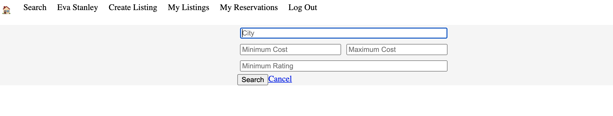
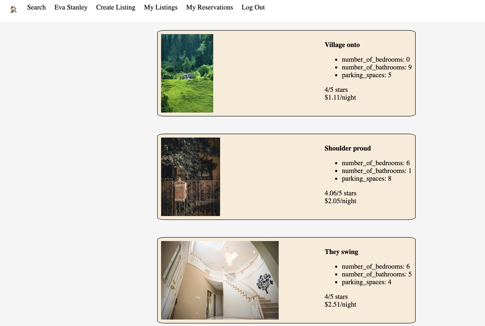

# LightBnB

## Project Structure

```
├── public
│   ├── index.html
│   ├── javascript
│   │   ├── components 
│   │   │   ├── header.js
│   │   │   ├── login_form.js
│   │   │   ├── new_property_form.js
│   │   │   ├── property_listing.js
│   │   │   ├── property_listings.js
│   │   │   ├── search_form.js
│   │   │   └── signup_form.js
│   │   ├── index.js
│   │   ├── libraries
│   │   ├── network.js
│   │   └── views_manager.js
│   └── styles
├── sass
└── server
  ├── apiRoutes.js
  ├── database.js
  ├── json
  ├── server.js
  └── userRoutes.js
```

* `public` contains all of the HTML, CSS, and client side JavaScript. 
  * `index.html` is the entry point to the application. It's the only html page because this is a single page application.
  * `javascript` contains all of the client side javascript files.
    * `index.js` starts up the application by rendering the listings.
    * `network.js` manages all ajax requests to the server.
    * `views_manager.js` manages which components appear on screen.
    * `components` contains all of the individual html components. They are all created using jQuery.
* `sass` contains all of the sass files. 
* `server` contains all of the server side and database code.
  * `server.js` is the entry point to the application. This connects the routes to the database.
  * `apiRoutes.js` and `userRoutes.js` are responsible for any HTTP requests to `/users/something` or `/api/something`. 
  * `json` is a directory that contains a bunch of dummy data in `.json` files.
  * `database.js` is responsible for all queries to the database. It doesn't currently connect to any database, all it does is return data from `.json` files.

## SQL Features 


> Users have the ability to carry out custom searches using one or multiple criteria to search for the listing which is right for them.


> Users  have the opportunity to log in and view their listings and reservations, personalized to them.

## Entity Relationship Diagram


> This ERD shows the relationship between the tables within the database, making it easier to understand the SQL queries within the app. (Created using dbdiagram.io)